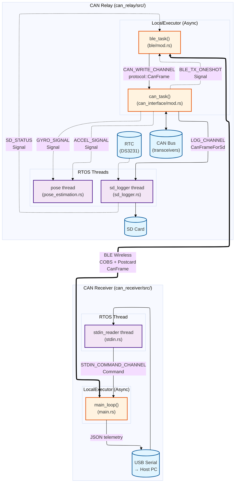

# CAN Telemetry System Architecture

This diagram shows the software architecture of the CAN Relay and CAN Receiver systems. Use the exact names shown here to navigate the codebase.

## Component Locations

### CAN Relay
- **Async Tasks** (LocalExecutor):
  - `can_task()`: `can_relay/src/can_interface/mod.rs`
  - `ble_task()`: `can_relay/src/ble/mod.rs`
- **RTOS Threads**:
  - `sd_logger`: `can_relay/src/sd_logger.rs`
  - `pose`: `can_relay/src/pose_estimation.rs`
- **Static Channels/Signals**: `can_relay/src/main.rs`
  - `LOG_CHANNEL`: Channel<CanFrameForSd, 256>
  - `CAN_WRITE_CHANNEL`: Channel<protocol::CanFrame, 256>
  - `BLE_TX_ONESHOT`: Signal<BleCanLink>
  - `SD_STATUS`: Signal<SdStatus> (in sd_logger.rs)
  - `ACCEL_SIGNAL`, `GYRO_SIGNAL`: Signals in pose_estimation.rs

### CAN Receiver
- **Async Task** (LocalExecutor):
  - `main_loop()`: `can_receiver/src/main.rs`
- **RTOS Thread**:
  - `stdin_reader`: `can_receiver/src/stdin.rs`
- **Static Channel**: `can_receiver/src/main.rs`
  - `STDIN_COMMAND_CHANNEL`: Channel<Command, 32>

## External Hardware
- **CAN Bus**: Via CAN transceivers (not built into ESP32C6)
- **RTC**: DS3231 I2C real-time clock (not built into ESP32C6)
- **SD Card**: Connected via SPI (card itself is external)
- **USB Serial**: To host PC for telemetry output

## Data Flows
- **CAN → SD Logging**: CAN frames flow through `LOG_CHANNEL` to SD card
- **CAN → BLE → USB**: Telemetry data sent wirelessly, serialized as JSON to USB
- **USB → BLE → CAN**: Commands from host flow back to CAN bus
- **IMU Processing**: Accelerometer and gyroscope signals to pose estimation
